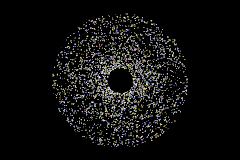

# n-body-problem

Implementation of a numeric simulation of the n-body problem. This includes both the accurate O(n^2) version of the algorithm that calculates every single interaction and a O(n log n) simplification using Quad-/Octrees. Mostly meant as a playground to explore various speed up approaches like compiler intrinsics or CUDA.
Build it with CMake. There are several build types available via preprocessor directives: SISD, SIMD, multi-threaded and Octree versions of those two and a CUDA version. I'll eventually make this nice, for now they're flags in the CMake file. Fair warning: the Octree implementation may crash if the simulation goes on for very long and bodies go very far off from where they started, I'll have to implement a maximum recursion size to prevent this.

All build types need the SFML library, so make sure that the SFML_DIR env variable is set correctly (or edit the CMakeLists.txt with your personal path). The CUDA variant obviously also needs the CUDA toolkit to be installed on your PC.
The release version is the single-threaded SIMD O^2 variant built for Windows x64 systems.

Small FPS benchmark on my system (Ryzen 5950x, RTX3080Ti):

| num. bodies | SISD   (multi-threaded)   (Octree)   (both) | SIMD   (multi-threaded)   (Octree) | CUDA |
|:-------------:|:------:|:------:|:------:|
| 80          |   4900   (3300)   (4500)  |   4800   (3400)   |   2700   |
| 800         |   460   (530)   (850) |   790   (900)  |   870   |
| 8000        |   8   (20)   (60) |   18   (55)  |    92  |

| num. bodies @ 30 FPS | SISD | SIMD | CUDA |
|:-------------:|:------:|:------:|:------:|
| -         |   3400   (7000)   (16000)  |   5900   (11500)   |   19500   |

## Controls

The setup provides onscreen instructions. During simulation:
- mouse wheel zooms in and out
- clicking and dragging moves the camera view around
- pressing and holding L-CTRL makes zooming and dragging faster
- pressing R resets zoom to default and focuses the camera on 0,0
- pressing F toggles the display of the FPS counter, the processing type, gravity and the timestep
- pressing Numpad+/- (+ L-CTRL) increases/decreases gravity (the timestep)
- pressing S flips gravity around
- pressing T sends you back to the setup menu
- in the Octree version, holding O/P and scrolling the mouse wheel will change the maxmimum node size/tolerance of the Octree

## Acknowledgements

Uses [SFML](https://www.sfml-dev.org/index.php) for rendering & user input and the [Routed Gothic Typeface](https://github.com/dse/routed-gothic) by Darren Emby for texts.