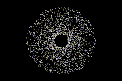

# n-body-problem



Implementation of a numeric simulation of the n-body problem. This includes both the accurate O(n^2) version of the algorithm that calculates every single interaction and a O(n log n) simplification using Quad-/Octrees. Mostly meant as a playground to explore various speed up approaches like compiler intrinsics or CUDA.
Build it with CMake. There are several build types available via preprocessor directives: SISD, SIMD, multi-threaded and Octree versions of those two and a CUDA version. I'll eventually make this nice, for now they're flags in the CMake file. Fair warning: the Octree implementation may crash if the simulation goes on for very long and bodies go very far off from where they started, I'll have to implement a maximum recursion size to prevent this.

All build types need SFML 3.1.0. The default CMake configuration expects it at `D:/Speicher/C++/SFML-3.1.0`; set the `SFML_DIR` environment variable or pass `-DSFML_DIR=...` if it is installed elsewhere. The CUDA variant obviously also needs the CUDA toolkit to be installed on your PC as well as Thrust, which should be included in most CUDA distributions.

## Building on Windows

Run the single build script from a Visual Studio Developer Prompt, PowerShell, or Git Bash:

```bat
build.bat Scalar Full
build.bat Scalar BaHu
build.bat SIMD Full
build.bat CUDA Full
```

These commands build the new headless greenfield targets. To build the original SFML application, use the explicit legacy mode:

```bat
build.bat legacy Scalar Full
build.bat legacy SIMD Full
```

The arguments select the compute backend and force model. The script configures a separate Ninja build directory, builds in Release mode, and prints the resulting executable path. CMake and Ninja must be on `PATH`; the script automatically initializes the installed MSVC Build Tools when possible.

The initial greenfield executable accepts `3` or `3D` to exercise the three-dimensional state path:

```bat
build\greenfield-Scalar-Full\nbody_app.exe 3D
build\greenfield-Scalar-Full\nbody_benchmark.exe 3D
```
The release version is the single-threaded SIMD O^2 variant built for Windows x64 systems.

Small FPS benchmark on my system (Ryzen 5950x, RTX3080Ti):

| num. bodies | SISD <br> (multi-threaded) <br> (Octree) <br> (both) | SIMD <br> (multi-threaded) <br> (Octree) | CUDA |
|:-------------:|:------:|:------:|:------:|
| 80          |   4900 <br> (3300) <br> (4500) <br> (3100)  |   4800 <br> (3400) <br> (4600)  |   2700   |
| 800         |   460 <br> (530) <br> (800) <br> (780) |   790 <br> (900) <br> (920)  |   870   |
| 8000        |   8 <br> (20) <br> (60) <br> (90) |   18 <br> (55) <br> (60) |    92  |

| num. bodies @ 30 FPS | SISD | SIMD | CUDA |
|:-------------:|:------:|:------:|:------:|
| -         |   3400 <br> (7000) <br> (16000) <br> (21000)  |   5900 <br> (11500) <br> (13200)  |   19500   |


## Controls

The setup provides onscreen instructions. During simulation:
- mouse wheel zooms in and out
- clicking and dragging moves the camera view around
- pressing and holding L-CTRL makes zooming and dragging faster
- pressing R resets zoom to default and focuses the camera on 0,0
- pressing F toggles the display of the FPS counter, the processing type, gravity and the timestep
- pressing Numpad+/- (+ L-CTRL) increases/decreases gravity (the timestep)
- pressing S flips gravity around
- pressing T sends you back to the setup menu
- in the Octree version, holding O/P and scrolling the mouse wheel will change the maximum node size/tolerance of the Octree

## Acknowledgements

Uses [SFML](https://www.sfml-dev.org/index.php) for rendering & user input and the [Routed Gothic Typeface](https://github.com/dse/routed-gothic) by Darren Emby for texts.
